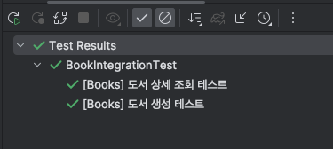
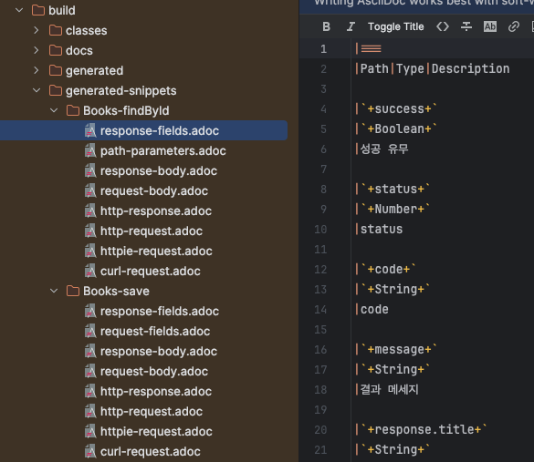
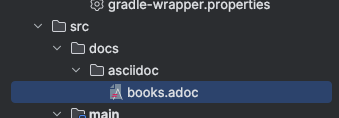
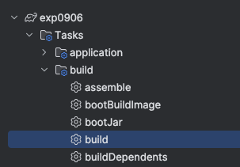
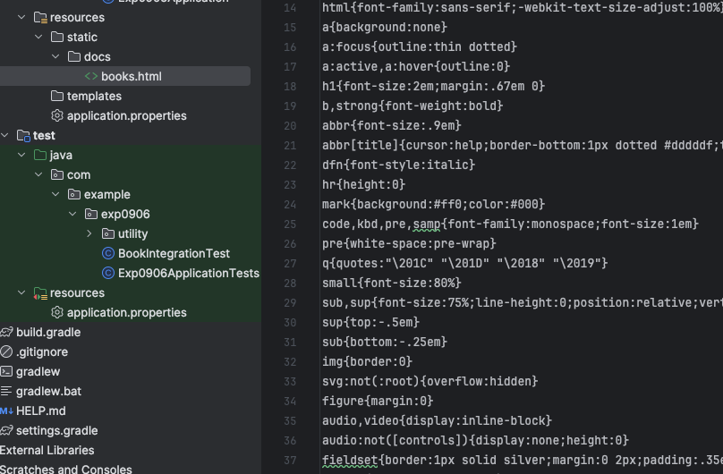
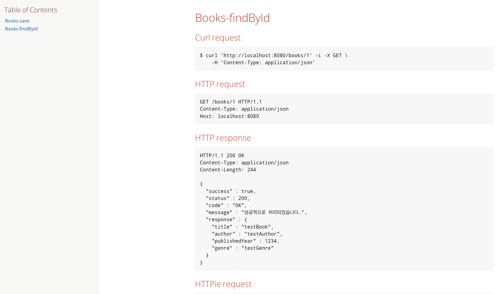

## 1\. API 명세서 관련 문제점 (엑셀, 노션 등…)

-   Production 코드와의 불일치
-   문서에 대한 신뢰성 문제
-   비효율적인 커뮤니케이션

## 2\. RestDocs VS Swagger

### 2-2. Swagger 장단점

장점

-   적용하기 쉽다.
-   API 테스트 환경 제공

단점

-   production 코드가 지저분해진다

### 2-3. RestDocs 장단점

장점

-   테스트를 통과해야 문서가 만들어진다 (신뢰도↑)
-   API 명세 최신화가 강제
-   Production 코드에 영향이 없다. (메인 코드 즉 비즈니스 개발에 초점을 둘 수 있다.)

단점

-   어렵다 → 통합 테스트 기반으로 돌아가기 때문에 모든 API 테스트를 진행해야됨
-   테스트 코드 양이 많아 진다.

### 2-4. 결론

-   Msa 환경에서는 RestDocs 혹은 OpenAPI Specification 를 통해 API 문서 서버를 두어 통합 관리 한다.

> OpenAPI Specification == RestDocs + Swagger  
> RestDocs의 신뢰성있는 API 문서 데이터를 Swagger UI에 통합 하여 신뢰성 + 테스트 기능 까지 가능 하게 하는 문서화 기법이다.

## 3\. RestDocs 사용법

### 3-1. 의존성 주입

```
plugins {
    id 'java'
    id 'org.springframework.boot' version '3.3.3'
    id 'io.spring.dependency-management' version '1.1.6'
    id 'org.asciidoctor.jvm.convert' version '3.3.2'
}

group = 'com.example'
version = '0.0.1-SNAPSHOT'

repositories {
    mavenCentral()
}

ext {
    set('snippetsDir', file("build/generated-snippets")) // 스니펫 dir 변수 선언 그 변수에는 스니펫 폴더를 넣겠다.
}

java {
    toolchain {
        languageVersion = JavaLanguageVersion.of(17)
    }
}

configurations {
    asciidoctorExtensions
    compileOnly {
        extendsFrom annotationProcessor
    }
}

repositories {
    mavenCentral()
}

dependencies {
    //spring
    implementation 'org.springframework.boot:spring-boot-starter-data-jpa'
    implementation 'org.springframework.boot:spring-boot-starter-web'

    //utility
    compileOnly 'org.projectlombok:lombok'
    annotationProcessor 'org.projectlombok:lombok'

    //db
    runtimeOnly 'com.h2database:h2'

    // test
    testImplementation 'org.springframework.boot:spring-boot-starter-test'
    testRuntimeOnly 'org.junit.platform:junit-platform-launcher'
    testImplementation 'org.springframework.restdocs:spring-restdocs-mockmvc'
    asciidoctorExtensions 'org.springframework.restdocs:spring-restdocs-asciidoctor'
}

tasks.named('test') {
    outputs.dir snippetsDir // Test 후 스니펫이라는 산출물 조각이 생기면 디렉토리를 지정
    useJUnitPlatform()
}

tasks.named('asciidoctor') {
    configurations "asciidoctorExtensions"
    inputs.dir snippetsDir // 스니펫이라는 조각을 html로 만들어줌
    dependsOn test // 빌드를 하면 여러개의 task가 실행됨 -> 즉 아스키는 test라는 test가 끝나고 실행 되겠다.
}

// 카피 다큐맨트: 재 빌드 후 html 파일을 지우고 재생성 -> 산출물 동기화
task copyDocument(type: Copy) {
    dependsOn asciidoctor // 아스키닥터가 끝난 뒤 실행 하겠다
    from file("${asciidoctor.outputDir}") // html 실제 저장된 파일을 아래의 정적 경로로 복사
    into file("src/main/resources/static/docs")
}

build {
    dependsOn copyDocument // 빌드는 카피다큐먼트가 끝난 이후에 실행
}
bootJar {
    dependsOn copyDocument
    from ("${asciidoctor.outputDir}") {
        into 'static/docs'
    }
}
```

### 3-2. 예시 테스트 코드 작성

> 간단한 도서 CURD 서버에서 테스트를 진행했습니다.

```
public interface ApiDocumentUtils {

    static OperationRequestPreprocessor getRequestPreProcessor() {
        return preprocessRequest(prettyPrint());
    }

    static OperationResponsePreprocessor getResponsePreProcessor() {
        return preprocessResponse(prettyPrint());
    }
}
```

```
package com.example.exp0906;

@SpringBootTest
@AutoConfigureMockMvc
@ExtendWith(RestDocumentationExtension.class)
public class BookIntegrationTest { // 통합 테스트

    @Autowired
    private BookRepository bookRepository;

    private MockMvc mockMvc;

    @BeforeEach
    void setUpMockMvcForRestDocs(WebApplicationContext webApplicationContext,
                                 RestDocumentationContextProvider restDocumentationContextProvider) {
        this.mockMvc = MockMvcBuilders
                .webAppContextSetup(webApplicationContext)
                .apply(documentationConfiguration(restDocumentationContextProvider))
                .build();
    }

    private ObjectMapper objectMapper = new ObjectMapper();

    @BeforeEach
    public void tearDown() {
        bookRepository.deleteAll();
    }

    @Test
    @DisplayName("[Books] 도서 생성 테스트")
    void 도서_생성_테스트() throws Exception {
        //given
        BookReqDto bookReqDto = new BookReqDto("testBook", "testAuthor", 1234, "testGenre");
        //when
        ResultActions actions = mockMvc.perform(
                post("/books")
                        .contentType(APPLICATION_JSON)
                        .accept(APPLICATION_JSON)
                        .content(objectMapper.writeValueAsString(bookReqDto))
        );

        //then
        actions
                .andExpect(status().isCreated())
                .andExpect(jsonPath("$.success").isNotEmpty())
                .andExpect(jsonPath("$.status").isNotEmpty())
                .andExpect(jsonPath("$.code").isNotEmpty())
                .andExpect(jsonPath("$.message").isNotEmpty())
                .andExpect(jsonPath("$.response.id").isNotEmpty())

                .andDo(document("Books-save",
                        getRequestPreProcessor(),
                        getResponsePreProcessor(),
                        requestFields(
                                fieldWithPath("title").description("Title for book").type(JsonFieldType.STRING),
                                fieldWithPath("author").description("Author for Book").type(JsonFieldType.STRING),
                                fieldWithPath("publishedYear").description("PublishedYear for Book").type(JsonFieldType.NUMBER),
                                fieldWithPath("genre").description("Genre for Book").type(JsonFieldType.STRING)
                        ),
                        responseFields(
                                fieldWithPath("success").description("성공 유무"),
                                fieldWithPath("status").description("status"),
                                fieldWithPath("code").description("code"),
                                fieldWithPath("message").description("결과 메세지"),
                                fieldWithPath("response.id").description("Id for Book")
                        )
                ))
                .andDo(print());
    }

    @Test
    @DisplayName("[Books] 도서 상세 조회 테스트")
    void 도서_상세_조회_테스트() throws Exception{
        //given
        BookReqDto bookReqDto = new BookReqDto("testBook", "testAuthor", 1234, "testGenre");
        MvcResult result = mockMvc.perform(
                post("/books")
                        .contentType(APPLICATION_JSON)
                        .content(objectMapper.writeValueAsString(bookReqDto))
                )
                .andExpect(status().isCreated())
                .andExpect(jsonPath("$.success").isNotEmpty())
                .andExpect(jsonPath("$.status").isNotEmpty())
                .andExpect(jsonPath("$.code").isNotEmpty())
                .andExpect(jsonPath("$.message").isNotEmpty())
                .andExpect(jsonPath("$.response.id").isNotEmpty())
                .andDo(print())
                .andReturn();

        JsonNode jsonNode = objectMapper.readTree(result.getResponse().getContentAsString());
        Long bookId = jsonNode.get("response").get("id").asLong();

        //when
        ResultActions actions = mockMvc.perform(get("/books/{bookId}", bookId)
                .contentType(APPLICATION_JSON)
        );

        //then
        actions
                .andExpect(status().isOk())
                .andExpect(jsonPath("$.success").value("true"))
                .andExpect(jsonPath("$.status").value("200"))
                .andExpect(jsonPath("$.code").value("OK"))
                .andExpect(jsonPath("$.message").value("성공적으로 처리되었습니다."))
                .andExpect(jsonPath("$.response.title").value("testBook"))
                .andExpect(jsonPath("$.response.author").value("testAuthor"))
                .andExpect(jsonPath("$.response.publishedYear").value(1234))
                .andExpect(jsonPath("$.response.genre").value("testGenre"))

                .andDo(document("Books-findById",
                        getRequestPreProcessor(),
                        getResponsePreProcessor(),
                        pathParameters(parameterWithName("bookId").description("bookId for findBy id")),
                        responseFields(
                                fieldWithPath("success").description("성공 유무").type(JsonFieldType.BOOLEAN),
                                fieldWithPath("status").description("status").type(JsonFieldType.NUMBER),
                                fieldWithPath("code").description("code").type(JsonFieldType.STRING),
                                fieldWithPath("message").description("결과 메세지").type(JsonFieldType.STRING),
                                fieldWithPath("response.title").description("도서 제목").type(JsonFieldType.STRING),
                                fieldWithPath("response.author").description("도서 저자").type(JsonFieldType.STRING),
                                fieldWithPath("response.publishedYear").description("도서 출판일").type(JsonFieldType.NUMBER),
                                fieldWithPath("response.genre").description("도서 장르").type(JsonFieldType.STRING)
                        )))
                .andDo(print());
    }
}
```

### 3-3. 스니펫 생성 방법

-   테스트를 실행한다. (Test를 통과해야지만 스니펫 조각이 생성이 됩니다. RestDocs의 장점 !)



-   스니펫 확인 (build → generated-snippets)



### 3-4. API 문서 html 추출 하기

-   src → docs → asciiDoc → \[원하는 adoc\] 작성



\[예시\]

```
= FOSS Rest Docs _ Books
:doctype: book
:icons: front
:source-highlighter: highlighsjs
:toc: left
:toclevels: 1

[[Books-save]]
== Books-save
operation::Books-save[]

[[Books-findById]]
== Books-findById
operation::Books-findById[]
```

-   빌드를 진행해 줍니다.



-   생성된 html 확인



## 4\. 결과

API 문서가 정상적으로 생성되었습니다.



ref

> [https://techblog.woowahan.com/2678/](https://techblog.woowahan.com/2678/)  
> [https://tech.kakaopay.com/post/openapi-documentation/](https://tech.kakaopay.com/post/openapi-documentation/)  
> [https://velog.io/@glencode/Spring-REST-Docs-적용하기-aka.-자동-API-문서화](https://velog.io/@glencode/Spring-REST-Docs-%EC%A0%81%EC%9A%A9%ED%95%98%EA%B8%B0-aka.-%EC%9E%90%EB%8F%99-API-%EB%AC%B8%EC%84%9C%ED%99%94)